# How the WoW Forever addon skills work

Mermaid diagrams of wow-addon-scaffold, wow-addon-ui, wow-addon-publish-release and wow-forever-macros, and how they connect with each other and with the other skills in this repository.

Legend: a solid arrow means the skill tells you to use it, hands over to it, or the next step always happens. A dotted arrow means it is optional or only happens when a condition is met, as the "Works with other skills" tables say. Decision branches are drawn dotted when the branch is only offered or conditional, and solid when the flow always takes one of the branches. Grey rounded boxes are not skills.

## 1. The four skills and the skills they work with

### 1a. wow-addon-scaffold

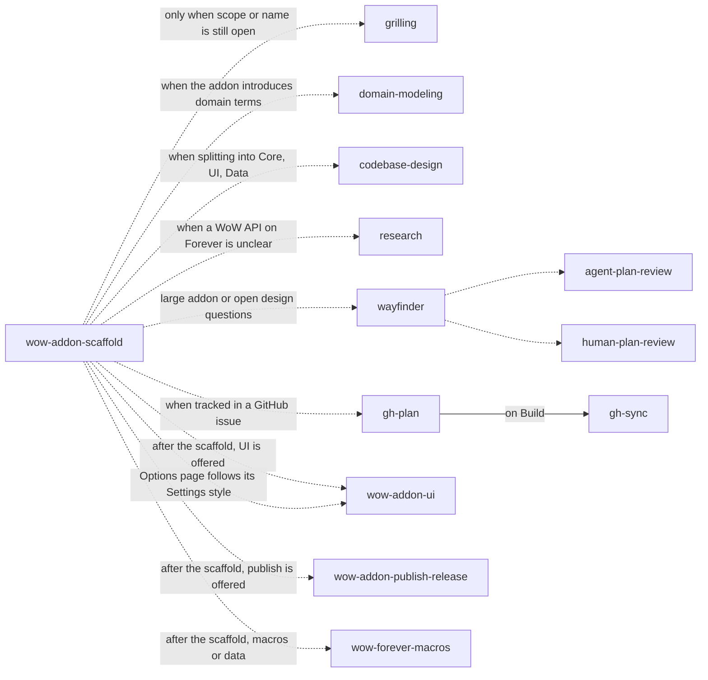
```mermaid
flowchart LR
  scaf["wow-addon-scaffold"]
  grill["grilling"]
  dm["domain-modeling"]
  cd["codebase-design"]
  res["research"]
  way["wayfinder"]
  pr["agent-plan-review"]
  hpr["human-plan-review"]
  ghplan["gh-plan"]
  ghsync["gh-sync"]
  ui["wow-addon-ui"]
  pub["wow-addon-publish-release"]
  macros["wow-forever-macros"]

  scaf -.->|"only when scope or name is still open"| grill
  scaf -.->|"when the addon introduces domain terms"| dm
  scaf -.->|"when splitting into Core, UI, Data"| cd
  scaf -.->|"when a WoW API on Forever is unclear"| res
  scaf -.->|"large addon or open design questions"| way
  way -.-> pr
  way -.-> hpr
  scaf -.->|"when tracked in a GitHub issue"| ghplan
  ghplan -->|"on Build"| ghsync
  scaf -.->|"after the scaffold, UI is offered"| ui
  scaf -.->|"Options page follows its Settings style"| ui
  scaf -.->|"after the scaffold, publish is offered"| pub
  scaf -.->|"after the scaffold, macros or data"| macros
```

### 1b. wow-addon-ui

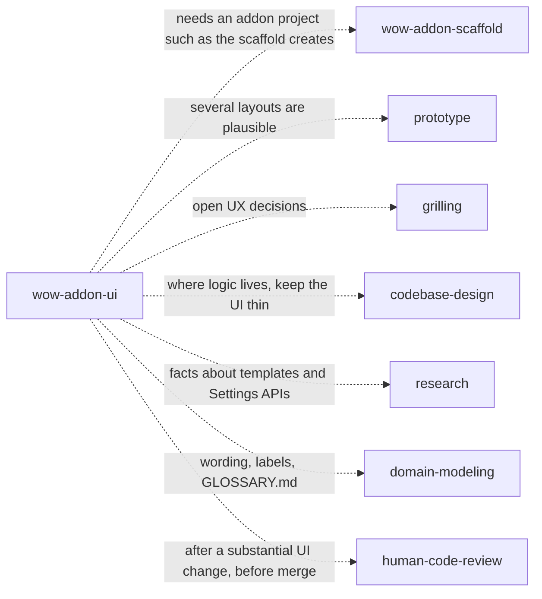
```mermaid
flowchart LR
  ui["wow-addon-ui"]
  scaf["wow-addon-scaffold"]
  proto["prototype"]
  grill["grilling"]
  cd["codebase-design"]
  res["research"]
  dm["domain-modeling"]
  hcr["human-code-review"]

  ui -.->|"needs an addon project such as the scaffold creates"| scaf
  ui -.->|"several layouts are plausible"| proto
  ui -.->|"open UX decisions"| grill
  ui -.->|"where logic lives, keep the UI thin"| cd
  ui -.->|"facts about templates and Settings APIs"| res
  ui -.->|"wording, labels, GLOSSARY.md"| dm
  ui -.->|"after a substantial UI change, before merge"| hcr
```

### 1c. wow-addon-publish-release

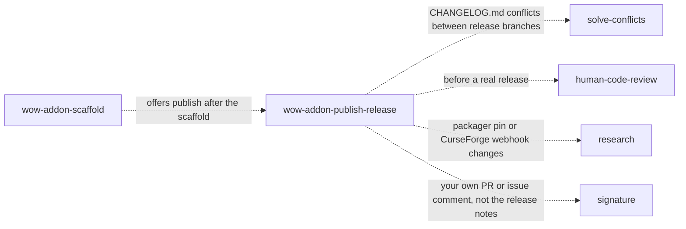
```mermaid
flowchart LR
  pub["wow-addon-publish-release"]
  scaf["wow-addon-scaffold"]
  sc["solve-conflicts"]
  hcr["human-code-review"]
  res["research"]
  sig["signature"]

  scaf -.->|"offers publish after the scaffold"| pub
  pub -.->|"CHANGELOG.md conflicts between release branches"| sc
  pub -.->|"before a real release"| hcr
  pub -.->|"packager pin or CurseForge webhook changes"| res
  pub -.->|"your own PR or issue comment, not the release notes"| sig
```

### 1d. wow-forever-macros

All of its integrations are optional and never override its own rules, so every arrow is dotted.

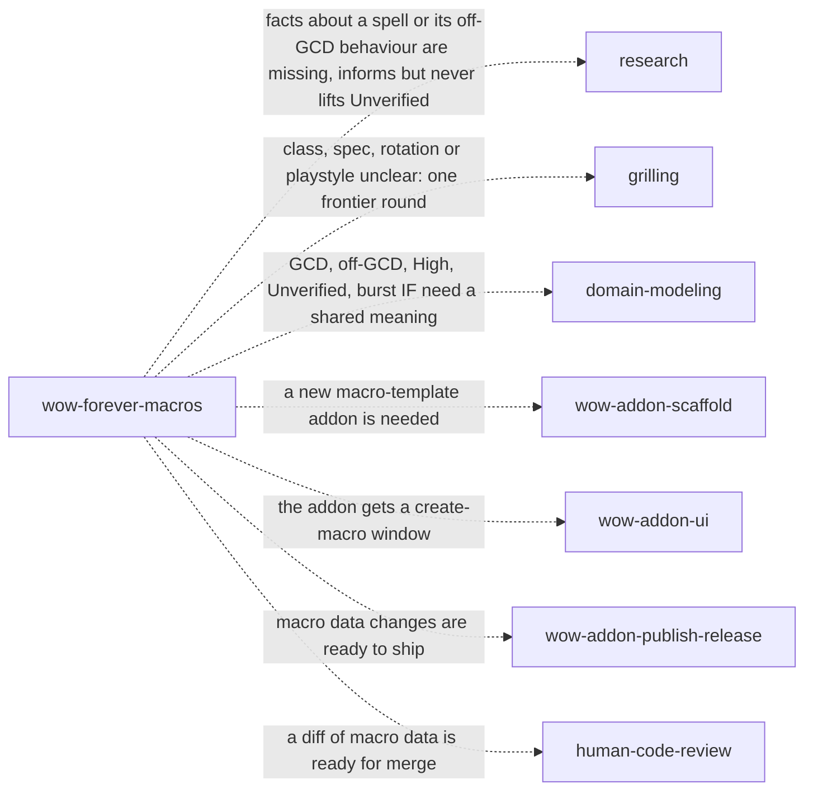
```mermaid
flowchart LR
  macros["wow-forever-macros"]
  res["research"]
  grill["grilling"]
  dm["domain-modeling"]
  scaf["wow-addon-scaffold"]
  ui["wow-addon-ui"]
  pub["wow-addon-publish-release"]
  hcr["human-code-review"]

  macros -.->|"facts about a spell or its off-GCD behaviour are missing, informs but never lifts Unverified"| res
  macros -.->|"class, spec, rotation or playstyle unclear: one frontier round"| grill
  macros -.->|"GCD, off-GCD, High, Unverified, burst IF need a shared meaning"| dm
  macros -.->|"a new macro-template addon is needed"| scaf
  macros -.->|"the addon gets a create-macro window"| ui
  macros -.->|"macro data changes are ready to ship"| pub
  macros -.->|"a diff of macro data is ready for merge"| hcr
```

## 2. The life of an addon

### 2a. From idea to scaffold

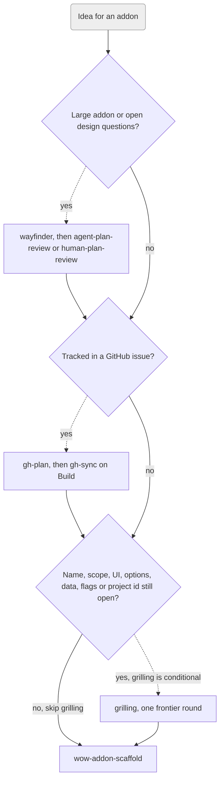
```mermaid
flowchart TD
  idea("Idea for an addon")
  big{"Large addon or open design questions?"}
  wayp["wayfinder, then agent-plan-review or human-plan-review"]
  trk{"Tracked in a GitHub issue?"}
  ghp["gh-plan, then gh-sync on Build"]
  unk{"Name, scope, UI, options, data, flags or project id still open?"}
  grill["grilling, one frontier round"]
  scaf["wow-addon-scaffold"]

  idea --> big
  big -.->|"yes"| wayp
  wayp --> trk
  big -->|"no"| trk
  trk -.->|"yes"| ghp
  ghp --> unk
  trk -->|"no"| unk
  unk -.->|"yes, grilling is conditional"| grill
  unk -->|"no, skip grilling"| scaf
  grill --> scaf

  classDef notskill fill:#eeeeee,stroke:#999999,color:#333333
  class idea notskill
```

### 2b. From scaffold to release

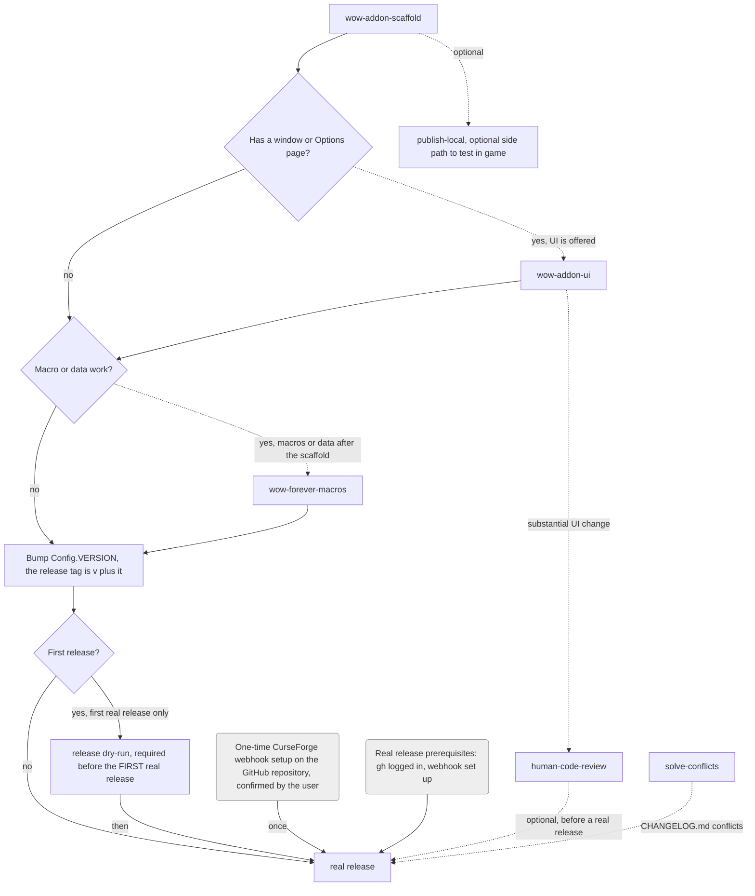
```mermaid
flowchart TD
  scaf["wow-addon-scaffold"]
  hasui{"Has a window or Options page?"}
  ui["wow-addon-ui"]
  hasm{"Macro or data work?"}
  macros["wow-forever-macros"]
  bump["Bump Config.VERSION, the release tag is v plus it"]
  hcr["human-code-review"]
  loc["publish-local, optional side path to test in game"]
  first{"First release?"}
  dry["release dry-run, required before the FIRST real release"]
  setup("One-time CurseForge webhook setup on the GitHub repository, confirmed by the user")
  prereq("Real release prerequisites: gh logged in, webhook set up")
  real["real release"]
  sc["solve-conflicts"]

  scaf --> hasui
  hasui -.->|"yes, UI is offered"| ui
  hasui -->|"no"| hasm
  ui --> hasm
  hasm -.->|"yes, macros or data after the scaffold"| macros
  hasm -->|"no"| bump
  macros --> bump
  bump --> first
  scaf -.->|"optional"| loc
  ui -.->|"substantial UI change"| hcr
  first -->|"yes, first real release only"| dry
  first -->|"no"| real
  dry -->|"then"| real
  setup -->|"once"| real
  prereq --> real
  hcr -.->|"optional, before a real release"| real
  sc -.->|"CHANGELOG.md conflicts"| real

  classDef notskill fill:#eeeeee,stroke:#999999,color:#333333
  class setup,prereq notskill
```

## 3. Scaffold: target layout and TOC load order

### 3a. Target layout

The full file list with the purpose of each file is in section (a) of wow-addon-publish-release/reference.md.

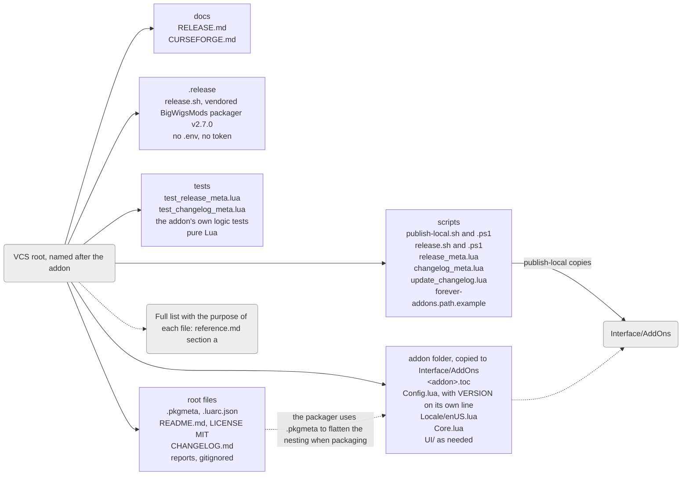
```mermaid
flowchart LR
  root("VCS root, named after the addon")
  addon["addon folder, copied to Interface/AddOns<br/>#lt;addon#gt;.toc<br/>Config.lua, with VERSION on its own line<br/>Locale/enUS.lua<br/>Core.lua<br/>UI/ as needed"]
  scripts["scripts<br/>publish-local.sh and .ps1<br/>release.sh and .ps1<br/>release_meta.lua<br/>changelog_meta.lua<br/>update_changelog.lua<br/>forever-addons.path.example"]
  docs["docs<br/>RELEASE.md<br/>CURSEFORGE.md"]
  rel[".release<br/>release.sh, vendored BigWigsMods packager v2.7.0<br/>no .env, no token"]
  tests["tests<br/>test_release_meta.lua<br/>test_changelog_meta.lua<br/>the addon's own logic tests<br/>pure Lua"]
  files["root files<br/>.pkgmeta, .luarc.json<br/>README.md, LICENSE MIT<br/>CHANGELOG.md<br/>reports, gitignored"]
  list("Full list with the purpose of each file: reference.md section a")
  aao("Interface/AddOns")

  root --> addon
  root --> scripts
  root --> docs
  root --> rel
  root --> tests
  root --> files
  files -.->|"the packager uses .pkgmeta to flatten the nesting when packaging"| addon
  scripts -->|"publish-local copies"| aao
  addon -.-> aao
  root -.-> list

  classDef notskill fill:#eeeeee,stroke:#999999,color:#333333
  class root,aao,list notskill
```

### 3b. TOC load order

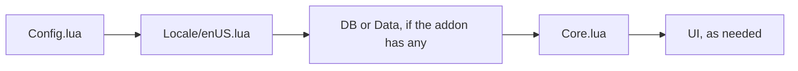
```mermaid
flowchart LR
  cfg["Config.lua"]
  loc["Locale/enUS.lua"]
  db["DB or Data, if the addon has any"]
  core["Core.lua"]
  ui["UI, as needed"]

  cfg --> loc --> db --> core --> ui
```

## 4. Release: publish-local, dry-run and real release

### 4a. publish-local

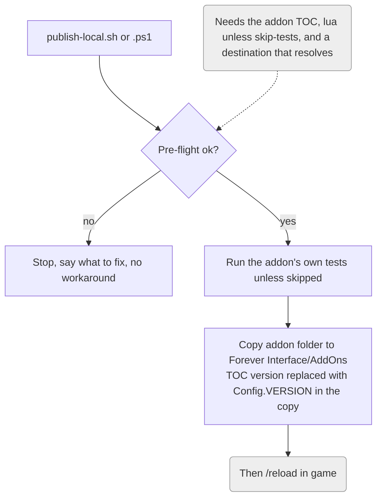
```mermaid
flowchart TD
  pl["publish-local.sh or .ps1"]
  pre{"Pre-flight ok?"}
  req("Needs the addon TOC, lua unless skip-tests, and a destination that resolves")
  pstop["Stop, say what to fix, no workaround"]
  tests["Run the addon's own tests unless skipped"]
  plc["Copy addon folder to Forever Interface/AddOns<br/>TOC version replaced with Config.VERSION in the copy"]
  reload("Then /reload in game")

  pl --> pre
  req -.-> pre
  pre -->|"no"| pstop
  pre -->|"yes"| tests --> plc --> reload

  classDef notskill fill:#eeeeee,stroke:#999999,color:#333333
  class req,reload notskill
```

### 4b. Release pre-flight and the dry-run

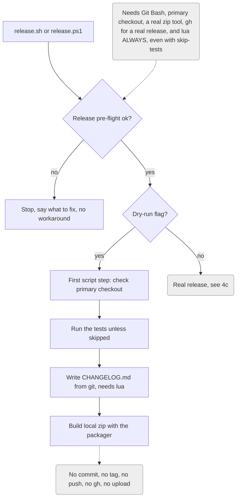
```mermaid
flowchart TD
  start["release.sh or release.ps1"]
  req("Needs Git Bash, primary checkout, a real zip tool, gh for a real release, and lua ALWAYS, even with skip-tests")
  gate{"Release pre-flight ok?"}
  stop0["Stop, say what to fix, no workaround"]
  mode{"Dry-run flag?"}
  chk["First script step: check primary checkout"]
  dt["Run the tests unless skipped"]
  dc["Write CHANGELOG.md from git, needs lua"]
  dz["Build local zip with the packager"]
  dno("No commit, no tag, no push, no gh, no upload")
  next("Real release, see 4c")

  start --> gate
  req -.-> gate
  gate -->|"no"| stop0
  gate -->|"yes"| mode
  mode -->|"yes"| chk --> dt --> dc --> dz
  dz -.-> dno
  mode -->|"no"| next

  classDef notskill fill:#eeeeee,stroke:#999999,color:#333333
  class req,dno,next notskill
```

### 4c. The real release, inside the script

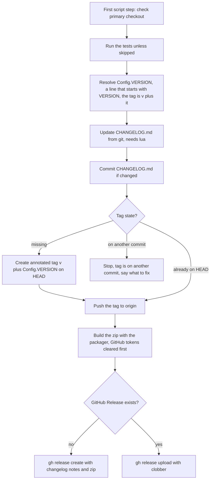
```mermaid
flowchart TD
  chk["First script step: check primary checkout"]
  tests["Run the tests unless skipped"]
  ver["Resolve Config.VERSION, a line that starts with VERSION, the tag is v plus it"]
  chg["Update CHANGELOG.md from git, needs lua"]
  commit["Commit CHANGELOG.md if changed"]
  tagq{"Tag state?"}
  mk["Create annotated tag v plus Config.VERSION on HEAD"]
  stop["Stop, tag is on another commit, say what to fix"]
  push["Push the tag to origin"]
  zip["Build the zip with the packager, GitHub tokens cleared first"]
  rel{"GitHub Release exists?"}
  gcr["gh release create with changelog notes and zip"]
  gup["gh release upload with clobber"]

  chk --> tests --> ver --> chg --> commit --> tagq
  tagq -->|"missing"| mk --> push
  tagq -->|"already on HEAD"| push
  tagq -->|"on another commit"| stop
  push --> zip --> rel
  rel -->|"no"| gcr
  rel -->|"yes"| gup
```

### 4d. Outside the script: CurseForge

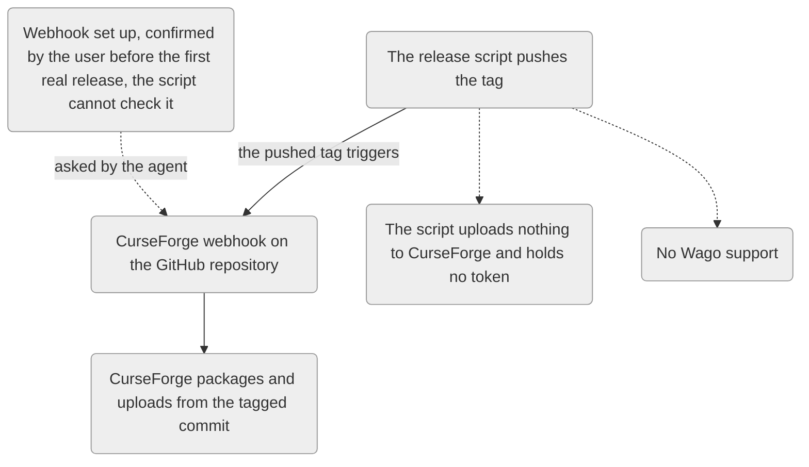
```mermaid
flowchart TD
  push("The release script pushes the tag")
  wconf("Webhook set up, confirmed by the user before the first real release, the script cannot check it")
  wh("CurseForge webhook on the GitHub repository")
  cf("CurseForge packages and uploads from the tagged commit")
  nocf("The script uploads nothing to CurseForge and holds no token")
  wago("No Wago support")

  wconf -.->|"asked by the agent"| wh
  push -->|"the pushed tag triggers"| wh
  wh --> cf
  push -.-> nocf
  push -.-> wago

  classDef notskill fill:#eeeeee,stroke:#999999,color:#333333
  class push,wconf,wh,cf,nocf,wago notskill
```

### 4e. One-time webhook setup

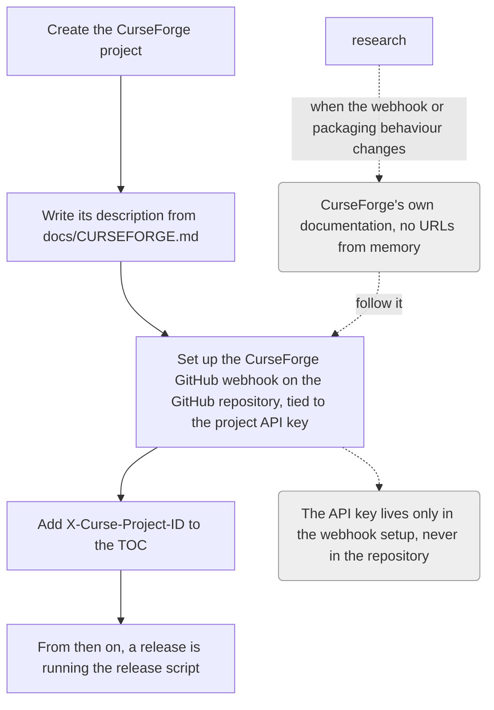
```mermaid
flowchart TD
  s1["Create the CurseForge project"]
  s2["Write its description from docs/CURSEFORGE.md"]
  s3["Set up the CurseForge GitHub webhook on the GitHub repository, tied to the project API key"]
  s4["Add X-Curse-Project-ID to the TOC"]
  s5["From then on, a release is running the release script"]
  doc("CurseForge's own documentation, no URLs from memory")
  key("The API key lives only in the webhook setup, never in the repository")
  res["research"]

  s1 --> s2 --> s3 --> s4 --> s5
  doc -.->|"follow it"| s3
  res -.->|"when the webhook or packaging behaviour changes"| doc
  s3 -.-> key

  classDef notskill fill:#eeeeee,stroke:#999999,color:#333333
  class doc,key notskill
```

## 5. UI: window, Options page and safety checks

### 5a. Main window

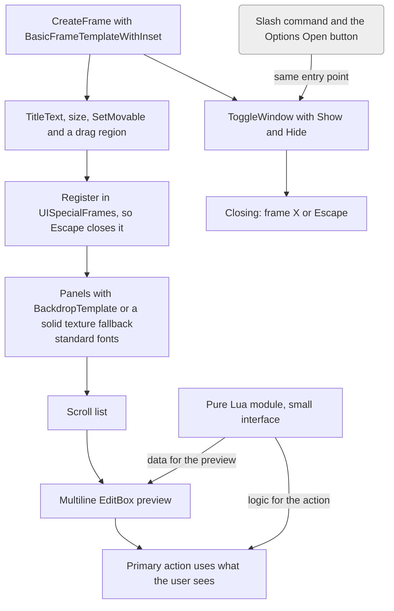
```mermaid
flowchart TD
  frame["CreateFrame with BasicFrameTemplateWithInset"]
  props["TitleText, size, SetMovable and a drag region"]
  usf["Register in UISpecialFrames, so Escape closes it"]
  look["Panels with BackdropTemplate or a solid texture fallback<br/>standard fonts"]
  lst["Scroll list"]
  prev["Multiline EditBox preview"]
  act["Primary action uses what the user sees"]
  pure["Pure Lua module, small interface"]
  tog["ToggleWindow with Show and Hide"]
  cls["Closing: frame X or Escape"]
  slash("Slash command and the Options Open button")

  frame --> props --> usf --> look
  look --> lst --> prev --> act
  pure -->|"data for the preview"| prev
  pure -->|"logic for the action"| act
  frame --> tog
  slash -->|"same entry point"| tog
  tog --> cls

  classDef notskill fill:#eeeeee,stroke:#999999,color:#333333
  class slash notskill
```

### 5b. Options page

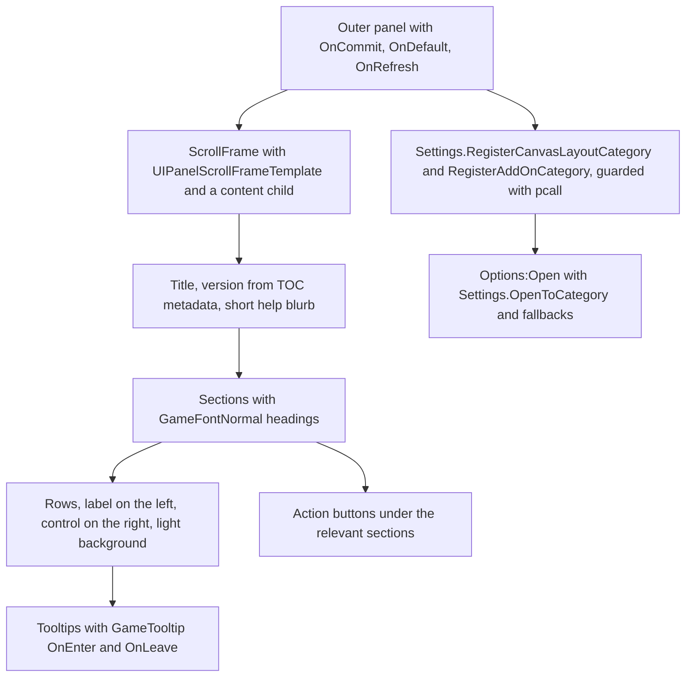
```mermaid
flowchart TD
  panel["Outer panel with OnCommit, OnDefault, OnRefresh"]
  scroll["ScrollFrame with UIPanelScrollFrameTemplate and a content child"]
  head["Title, version from TOC metadata, short help blurb"]
  sect["Sections with GameFontNormal headings"]
  rows["Rows, label on the left, control on the right, light background"]
  tips["Tooltips with GameTooltip OnEnter and OnLeave"]
  btns["Action buttons under the relevant sections"]
  reg["Settings.RegisterCanvasLayoutCategory and RegisterAddOnCategory, guarded with pcall"]
  open["Options:Open with Settings.OpenToCategory and fallbacks"]

  panel --> scroll --> head --> sect --> rows
  rows --> tips
  sect --> btns
  panel --> reg --> open
```

### 5c. Safety checks

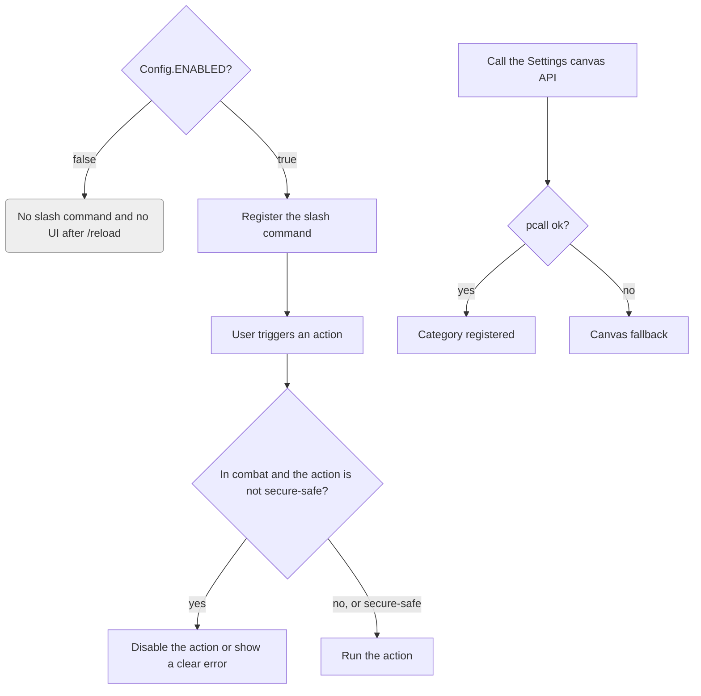
```mermaid
flowchart TD
  en{"Config.ENABLED?"}
  none("No slash command and no UI after /reload")
  slash["Register the slash command"]
  act["User triggers an action"]
  comb{"In combat and the action is not secure-safe?"}
  err["Disable the action or show a clear error"]
  run["Run the action"]
  api["Call the Settings canvas API"]
  pc{"pcall ok?"}
  cat["Category registered"]
  fb["Canvas fallback"]

  en -->|"false"| none
  en -->|"true"| slash --> act --> comb
  comb -->|"yes"| err
  comb -->|"no, or secure-safe"| run
  api --> pc
  pc -->|"yes"| cat
  pc -->|"no"| fb

  classDef notskill fill:#eeeeee,stroke:#999999,color:#333333
  class none notskill
```

## 6. Macros: writing a macro and its registry entry

### 6a. Deciding what goes into the macro

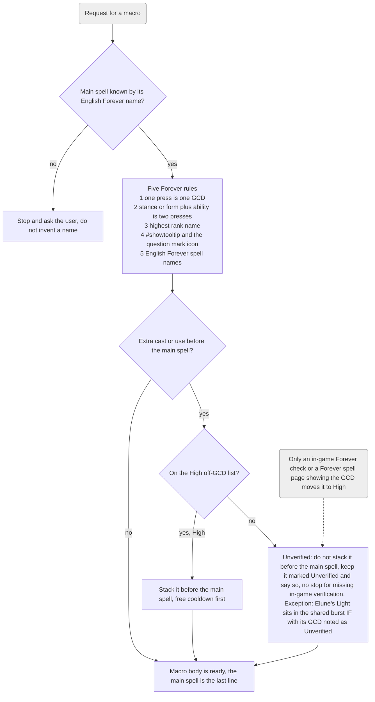
```mermaid
flowchart TD
  start("Request for a macro")
  known{"Main spell known by its English Forever name?"}
  stopm["Stop and ask the user, do not invent a name"]
  rules["Five Forever rules<br/>1 one press is one GCD<br/>2 stance or form plus ability is two presses<br/>3 highest rank name<br/>4 #showtooltip and the question mark icon<br/>5 English Forever spell names"]
  stack{"Extra cast or use before the main spell?"}
  gcd{"On the High off-GCD list?"}
  stackit["Stack it before the main spell, free cooldown first"]
  unv["Unverified: do not stack it before the main spell, keep it marked Unverified and say so, no stop for missing in-game verification. Exception: Elune's Light sits in the shared burst IF with its GCD noted as Unverified"]
  lift("Only an in-game Forever check or a Forever spell page showing the GCD moves it to High")
  body["Macro body is ready, the main spell is the last line"]

  start --> known
  known -->|"no"| stopm
  known -->|"yes"| rules --> stack
  stack -->|"no"| body
  stack -->|"yes"| gcd
  gcd -->|"yes, High"| stackit --> body
  gcd -->|"no"| unv --> body
  lift -.-> unv

  classDef notskill fill:#eeeeee,stroke:#999999,color:#333333
  class start,lift notskill
```

### 6b. Race expansion, registry entry and the CreateMacro checks

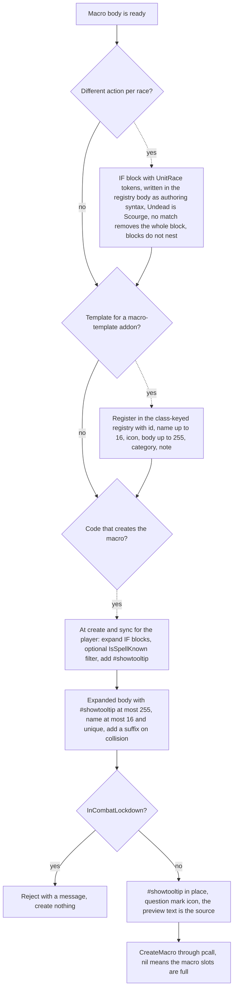
```mermaid
flowchart TD
  body["Macro body is ready"]
  race{"Different action per race?"}
  ifb["IF block with UnitRace tokens, written in the registry body as authoring syntax, Undead is Scourge, no match removes the whole block, blocks do not nest"]
  reg{"Template for a macro-template addon?"}
  entry["Register in the class-keyed registry with id, name up to 16, icon, body up to 255, category, note"]
  code{"Code that creates the macro?"}
  exp["At create and sync for the player: expand IF blocks, optional IsSpellKnown filter, add #showtooltip"]
  c1["Expanded body with #showtooltip at most 255, name at most 16 and unique, add a suffix on collision"]
  c2{"InCombatLockdown?"}
  rej["Reject with a message, create nothing"]
  c3["#showtooltip in place, question mark icon, the preview text is the source"]
  c4["CreateMacro through pcall, nil means the macro slots are full"]

  body --> race
  race -.->|"yes"| ifb
  race -->|"no"| reg
  ifb --> reg
  reg -.->|"yes"| entry
  reg -->|"no"| code
  entry --> code
  code -.->|"yes"| exp --> c1 --> c2
  c2 -->|"yes"| rej
  c2 -->|"no"| c3 --> c4
```

## 7. What each skill needs before it starts

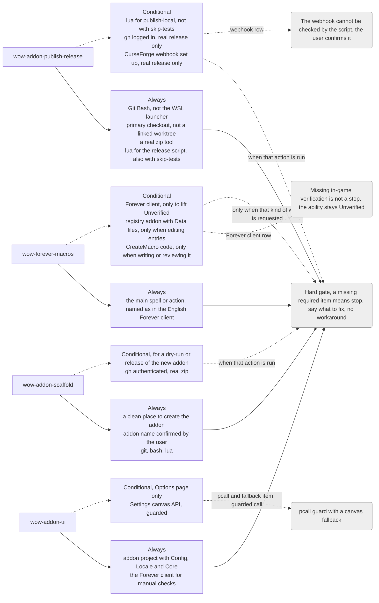
```mermaid
flowchart LR
  scaf["wow-addon-scaffold"]
  ui["wow-addon-ui"]
  pub["wow-addon-publish-release"]
  mac["wow-forever-macros"]
  sa["Always<br/>a clean place to create the addon<br/>addon name confirmed by the user<br/>git, bash, lua"]
  sc["Conditional, for a dry-run or release of the new addon<br/>gh authenticated, real zip"]
  ua["Always<br/>addon project with Config, Locale and Core<br/>the Forever client for manual checks"]
  uc["Conditional, Options page only<br/>Settings canvas API, guarded"]
  pa["Always<br/>Git Bash, not the WSL launcher<br/>primary checkout, not a linked worktree<br/>a real zip tool<br/>lua for the release script, also with skip-tests"]
  pc["Conditional<br/>lua for publish-local, not with skip-tests<br/>gh logged in, real release only<br/>CurseForge webhook set up, real release only"]
  ma["Always<br/>the main spell or action, named as in the English Forever client"]
  mc["Conditional<br/>Forever client, only to lift Unverified<br/>registry addon with Data files, only when editing entries<br/>CreateMacro code, only when writing or reviewing it"]
  gate("Hard gate, a missing required item means stop, say what to fix, no workaround")
  guard("pcall guard with a canvas fallback")
  wconf("The webhook cannot be checked by the script, the user confirms it")
  soft("Missing in-game verification is not a stop, the ability stays Unverified")

  scaf --> sa
  scaf -.-> sc
  ui --> ua
  ui -.-> uc
  pub --> pa
  pub -.-> pc
  mac --> ma
  mac -.-> mc
  sc -.->|"when that action is run"| gate
  uc -.->|"pcall and fallback item: guarded call"| guard
  pc -.->|"when that action is run"| gate
  pc -.->|"webhook row"| wconf
  mc -.->|"Forever client row"| soft
  mc -.->|"only when that kind of work is requested"| gate
  sa --> gate
  ua --> gate
  pa --> gate
  ma --> gate

  classDef notskill fill:#eeeeee,stroke:#999999,color:#333333
  class gate,guard,wconf,soft notskill
```
